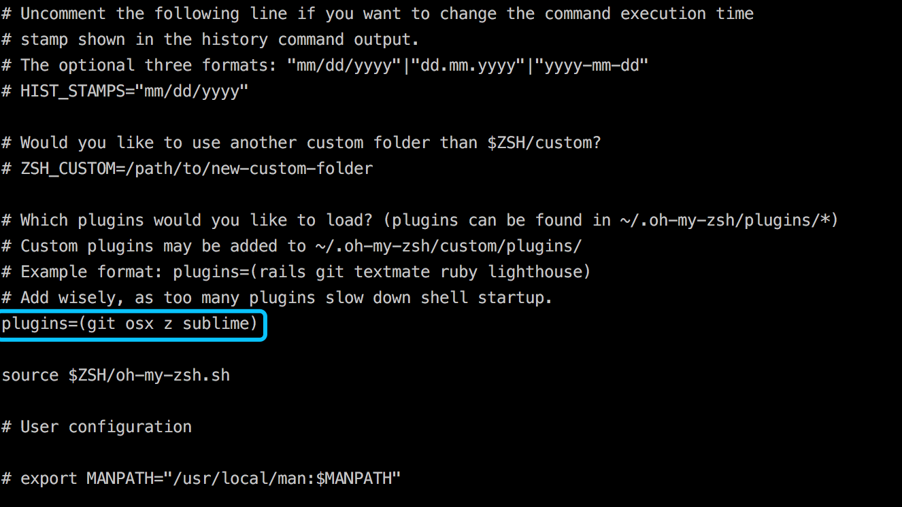

# iTerm2-Oh My Zsh

#### 介绍

Github: https://github.com/robbyrussell/oh-my-zsh

> Oh My Zsh is an open source, community-driven framework for managing your zsh configuration.

#### 安装

输入如下命令：

```bash
sh -c "$(curl -fsSL https://raw.githubusercontent.com/robbyrussell/oh-my-zsh/master/tools/install.sh)"
```

#### 配置插件

配置文件位置：`~/.zshrc`

```bash
vi ~/.zshrc
```

示意图：



在如上位置加入你需要用到的插件名称，保存后，执行以下命令，确保配置生效：

```bash
source ~/.zshrc
```

#### 插件列表

- z 快速跳转到常用目录，只需要按`Tab`
- git 配置了git的一系列功能，以及一些快捷命令
- sublime 提供了一些sublime的快捷命令，例如`st .`就可以用sublime打开当前目录