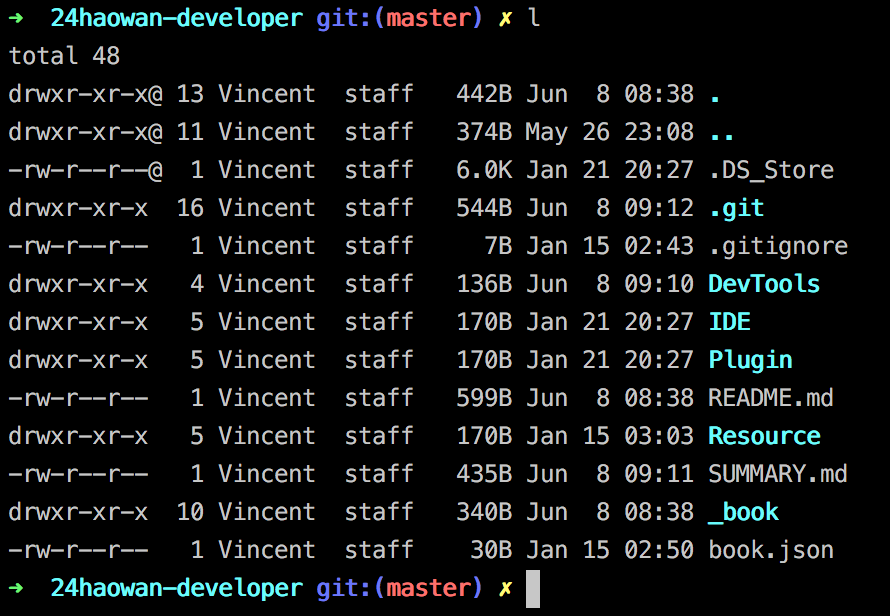

# iTerm2-Theme-Solarized

Solarized主页：http://ethanschoonover.com/solarized

#### 安装

```bash
git clone git://github.com/altercation/solarized.git
```

clone完成后，双击打开里面的文件即可：

solarized/iterm2-colors-solarized/

#### 效果图

